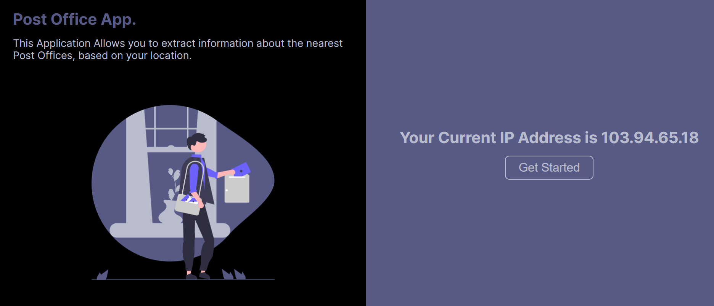
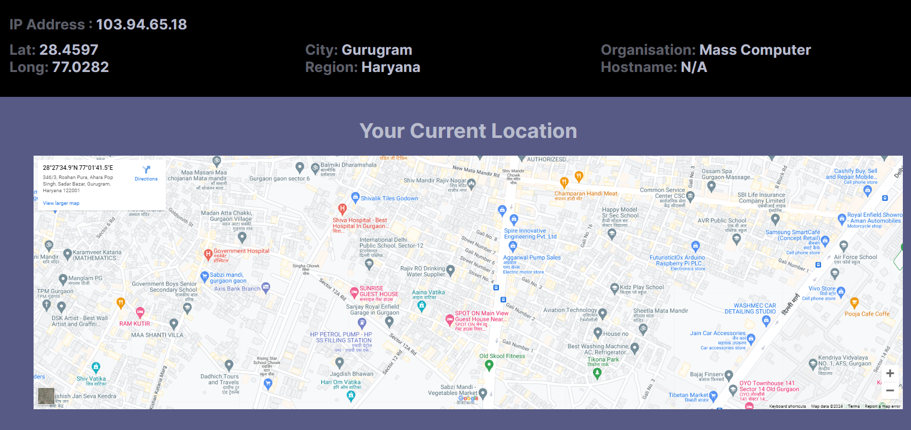
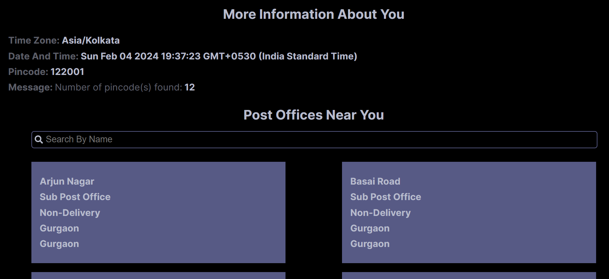

<h1>Post Office App</h1>

1. Used JS to get user's IP address.
2. Retrieved user's IP address using JS.
3. On page load, showing the user's IP address; on button click, retrieving information from the API.
4. Used the latitude and longitude from the JSON response to show the user's location on Google Maps.
5. Used the timezone from the JSON response to get the time of the user's location.
6. Displayed a list of post offices in the area corresponding to the pincode received from the user.
7. Added a search box to filter the list of post offices by name and branch office.

